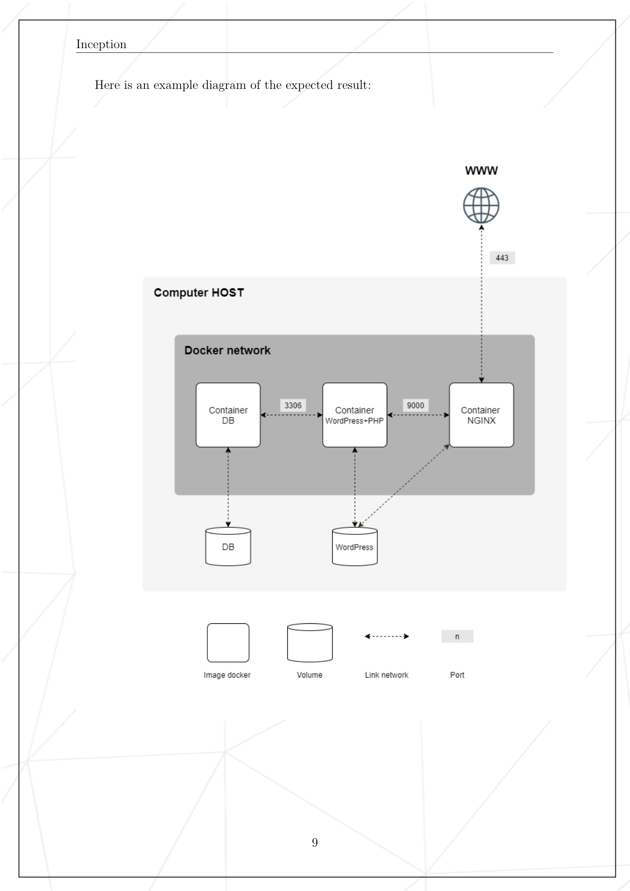

# Manual Evaluation Step By Step

## Test 1 - Estructura del repo

Comando:

```bash
ls -la
```

Que mira el evaluador:

- que exista `Makefile` en la raiz
- que exista `srcs/`

Que he comprobado:

- `Makefile` existe en la raiz
- `srcs/` existe en la raiz
- tambien estan los documentos `README.md`, `USER_DOC.md` y `DEV_DOC.md`

Que explico:

- el `Makefile` orquesta el proyecto
- `srcs/` contiene toda la configuracion, como pide el subject

## Test 2 - Archivos principales dentro de `srcs`

Comando:

```bash
find srcs -maxdepth 2 -type f | sort
```

Que mira el evaluador:

- que los archivos principales de configuracion esten dentro de `srcs/`
- especialmente `docker-compose.yml`
- y el fichero `.env`

Que he comprobado:

- `srcs/docker-compose.yml` existe
- `srcs/.env` existe
- hay un secreto local en `srcs/secrets/portainer_admin_password`

Que explico:

- el archivo central de orquestacion esta en `srcs/docker-compose.yml`
- las variables de entorno estan en `srcs/.env`
- el subject pide centralizar la configuracion dentro de `srcs/`

## Test 3 - No usar `network_mode: host` ni `links:`

Comando:

```bash
grep -nE 'network_mode: *host|links:' srcs/docker-compose.yml
```

Que mira el evaluador:

- que no uses `network_mode: host`
- que no uses `links:`

Que he comprobado:

- el comando no devuelve ninguna linea
- por tanto no uso ni `network_mode: host` ni `links:`

Que explico:

- uso una red Docker dedicada en lugar de `host`
- `links` esta obsoleto y ademas esta prohibido por el subject

## Test 4 - `docker-compose.yml` debe incluir `networks:`

Comando:

```bash
grep -n 'networks:' srcs/docker-compose.yml
```

Que mira el evaluador:

- que el compose defina redes
- que los servicios esten conectados a una red Docker

Que he comprobado:

- aparecen varias lineas `networks:` en los servicios
- y tambien la definicion final de la red en el compose

Que explico:

- cada servicio se conecta a la red `inception`
- esa red permite comunicacion interna por nombre entre contenedores

## Test 5 - No usar `--link`

Comando:

```bash
grep -RIn -- '--link' Makefile srcs
```

Que mira el evaluador:

- que no uses `--link` en `Makefile`
- que no uses `--link` en scripts o configuracion

Que he comprobado:

- el comando no devuelve ninguna coincidencia

Que explico:

- no uso `--link`
- la comunicacion entre servicios se hace por la red Docker definida en Compose

## Test 6 - No usar hacks prohibidos

Comando:

```bash
grep -RInE 'tail -f|sleep infinity|while true' srcs
```

Que mira el evaluador:

- que no uses `tail -f`
- que no uses `sleep infinity`
- que no uses `while true`

Que he comprobado:

- el comando no devuelve coincidencias

Que explico:

- los contenedores arrancan con procesos reales en foreground
- no mantengo contenedores vivos con hacks artificiales

## Test 7 - Construccion y arranque con `make build`

Comando:

```bash
make build
```

Que mira el evaluador:

- que el proyecto se construya desde el `Makefile`
- que use `docker compose`
- que las imagenes se construyan correctamente
- que los contenedores arranquen sin fallos

Que he comprobado:

- `make build` crea antes las carpetas:
  - `/home/aurodrig/data/mariadb`
  - `/home/aurodrig/data/wordpress`
- despues ejecuta:

```bash
docker compose -f srcs/docker-compose.yml up -d --build
```

- las imagenes se construyen correctamente
- los contenedores arrancan correctamente

Que explico:

- el `Makefile` es la entrada de ejecucion del proyecto
- no arranco servicios manualmente con `docker run`
- Compose construye y levanta toda la infraestructura declarada

## Test 8 - Ver contenedores levantados con `docker compose ps`

Comando:

```bash
docker compose -f srcs/docker-compose.yml ps
```

Que mira el evaluador:

- que los contenedores del proyecto esten creados
- especialmente `mariadb`, `wordpress` y `nginx`

Que he comprobado:

- `mariadb` esta `Up`
- `wordpress` esta `Up`
- `nginx` esta `Up`

Tambien aparecen los bonus:

- `redis`
- `ftp`
- `adminer`
- `static_site`
- `portainer`

Que explico:

- el mandatory esta levantado correctamente
- primero se valida mandatory
- el bonus solo cuenta si mandatory esta perfecto

## Test 9 - HTTPS responde y muestra WordPress

Prueba visual:

- abrir `https://127.0.0.1`
- abrir `https://aurodrig.42.fr`

Que mira el evaluador:

- que la web cargue por HTTPS
- que lo que aparece sea WordPress ya instalado
- que no aparezca la pantalla de instalacion

Que he comprobado visualmente:

- la pagina de WordPress carga correctamente
- funciona tanto con `127.0.0.1` como con `aurodrig.42.fr`

Prueba en terminal:

```bash
curl -kI https://127.0.0.1 | head -n 10
```

Salida relevante:

```text
HTTP/1.1 200 OK
Server: nginx/1.18.0
Content-Type: text/html; charset=UTF-8
Link: <https://aurodrig.42.fr/index.php?rest_route=/>; rel="https://api.w.org/"
```

Que explico:

- `nginx` responde por HTTPS
- delante esta `nginx`, por eso el header muestra `Server: nginx`
- WordPress ya esta instalado y servido detras de `nginx`

## Test 10 - HTTP en puerto 80 no debe responder

Prueba visual:

- abrir `http://127.0.0.1`
- abrir `http://aurodrig.42.fr`

Que mira el evaluador:

- que no se pueda acceder al sitio por HTTP
- que la unica entrada publica sea HTTPS por `443`

Que he comprobado visualmente:

- la pagina no carga por HTTP

Prueba en terminal:

```bash
curl -I http://127.0.0.1
```

Salida relevante:

```text
curl: (7) Failed to connect to 127.0.0.1 port 80 after 0 ms: Couldn't connect to server
```

Que explico:

- no hay servicio escuchando en el puerto 80
- el unico punto de entrada publico es `nginx` por HTTPS en `443`

## Test 11 - TLS 1.2 y TLS 1.3

Prueba visual:

- entrar por `https://127.0.0.1` o `https://aurodrig.42.fr`
- aceptar `Advanced` si el navegador avisa del certificado
- abrir el candado para enseñar que hay certificado HTTPS

Que mira el evaluador:

- que exista un certificado SSL/TLS
- que el sitio funcione con TLS 1.2 y TLS 1.3

Prueba en terminal TLS 1.2:

```bash
echo | openssl s_client -connect 127.0.0.1:443 -tls1_2 2>/dev/null | head -n 15
```

Salida relevante:

```text
CONNECTED(00000003)
Certificate chain
CN = aurodrig.42.fr
```

Prueba en terminal TLS 1.3:

```bash
echo | openssl s_client -connect 127.0.0.1:443 -tls1_3 2>/dev/null | head -n 15
```

Salida relevante:

```text
CONNECTED(00000003)
Certificate chain
CN = aurodrig.42.fr
```

Que he comprobado:

- el certificado existe
- el certificado es autofirmado
- TLS 1.2 funciona
- TLS 1.3 funciona

Que explico:

- el subject permite certificado autofirmado
- `nginx` acepta solo TLS 1.2 y TLS 1.3
- el certificado se genera automaticamente en el arranque si no existe

## Test 12 - Dockerfile de WordPress: sin nginx y con php-fpm

Comando:

```bash
sed -n '1,220p' srcs/requirements/wordpress/Dockerfile
```

Que mira el evaluador:

- que exista un Dockerfile para WordPress
- que WordPress use `php-fpm`
- que no instale `nginx`

Que he comprobado:

- el Dockerfile existe
- usa `FROM debian:bullseye`
- instala:
  - `php7.4-fpm`
  - `php7.4-mysql`
  - `curl`
  - `mariadb-client`
- expone el puerto `9000`
- no instala `nginx`

Que explico:

- el contenedor de WordPress solo ejecuta PHP-FPM
- `nginx` esta separado en otro contenedor
- `nginx` se conecta a WordPress por FastCGI en el puerto `9000`

## Test 13 - Volumen de WordPress y persistencia en el host

Prueba tecnica:

```bash
docker volume inspect wordpress_data
```

Que mira el evaluador:

- que exista el volumen de WordPress
- que sea un `named volume`
- que sus datos queden almacenados en `/home/aurodrig/data/wordpress`

Salida relevante:

```text
"Name": "wordpress_data"
"device": "/home/aurodrig/data/wordpress"
```

Prueba mas visual:

```bash
ls -la /home/aurodrig/data/wordpress | head
```

Que he comprobado visualmente:

- en el host aparecen archivos reales de WordPress
- se ven carpetas como:
  - `wp-admin`
  - `wp-content`
  - `wp-includes`
- se ve tambien `wp-config.php`

Que explico:

- el volumen se llama `wordpress_data`
- Docker lo gestiona como `named volume`
- pero su almacenamiento real esta en `/home/aurodrig/data/wordpress`
- asi la persistencia queda fuera del ciclo de vida del contenedor

## Test 14 - `/wp-admin` responde como WordPress instalado

Prueba visual:

- abrir `https://127.0.0.1/wp-admin`
- abrir `https://aurodrig.42.fr/wp-admin`

Que mira el evaluador:

- que WordPress ya este instalado
- que `/wp-admin` funcione
- que no aparezca la pantalla de instalacion inicial

Que he comprobado visualmente:

- aparece el formulario de login de WordPress
- no aparece la pantalla de instalacion

Prueba en terminal:

```bash
curl -kI https://127.0.0.1/wp-admin/ | head -n 10
```

Salida relevante:

```text
HTTP/1.1 302 Found
Server: nginx/1.18.0
X-Redirect-By: WordPress
Location: https://aurodrig.42.fr/wp-login.php?redirect_to=...
```

Que explico:

- `/wp-admin` redirige al login porque WordPress ya esta instalado
- si no estuviera instalado apareceria el instalador inicial

## Test 15 - Login de administrador y nombre valido

Prueba visual:

- entrar en `https://aurodrig.42.fr/wp-admin`
- hacer login con:
  - usuario: `aurodrig`
  - password: `123456`

Que mira el evaluador:

- que exista un usuario administrador
- que el nombre del admin no contenga `admin`

Que he comprobado:

- el login funciona correctamente
- el usuario administrador es `aurodrig`
- el nombre no contiene `admin`

Que explico:

- el subject exige dos usuarios en WordPress
- uno de ellos debe ser administrador
- el nombre del admin no puede incluir `admin` ni variantes

## Test 16 - Usuarios de WordPress y roles

Comando:

```bash
docker exec wordpress sh -lc "wp user list --allow-root --path=/var/www/html --fields=user_login,roles --format=table"
```

Que mira el evaluador:

- que existan dos usuarios en WordPress
- que uno sea administrador
- que el otro no sea admin

Salida relevante:

```text
user_login      roles
aurodrig        administrator
aurodrig_user   subscriber
```

Que he comprobado:

- existe un usuario administrador: `aurodrig`
- existe un usuario normal: `aurodrig_user`

Que explico:

- la instalacion inicial crea el admin y el usuario normal
- los usuarios se gestionan con WP-CLI desde el script de arranque

## Test 17 - Cambio manual visible en la web

Prueba visual:

- entrar al panel como admin
- editar una pagina
- cambiar el texto `blog` por `prueba`
- guardar y comprobar la web publica

Que mira el evaluador:

- que WordPress funciona de verdad
- que los cambios hechos desde admin se reflejan en la web

Verificacion por terminal:

```bash
curl -ks https://127.0.0.1 | grep -in 'prueba'
```

Salida relevante:

```text
206:<h1 class="wp-block-heading has-text-align-left">prueba </h1>
```

Que he comprobado:

- el cambio hecho en el panel aparece en el HTML servido por la web

Que explico:

- WordPress no solo esta instalado, tambien esta operativo
- los cambios persisten y se reflejan desde la administracion a la web publica

## Test 18 - Dockerfile de MariaDB: sin nginx

Comando:

```bash
sed -n '1,220p' srcs/requirements/mariadb/Dockerfile
```

Que mira el evaluador:

- que exista un Dockerfile para MariaDB
- que MariaDB este en su propio contenedor
- que no instale `nginx`

Que he comprobado:

- el Dockerfile existe
- usa `FROM debian:bullseye`
- instala:
  - `mariadb-server`
  - `mariadb-client`
- expone el puerto `3306`
- no instala `nginx`

Que explico:

- MariaDB vive en un contenedor dedicado
- no mezclo la base de datos con el servidor web
- el arranque lo hace un script que inicializa la base y despues ejecuta `mysqld`

## Test 19 - Volumen de MariaDB y persistencia en el host

Prueba tecnica:

```bash
docker volume inspect mariadb_data
```

Que mira el evaluador:

- que exista el volumen de MariaDB
- que sea un `named volume`
- que sus datos queden almacenados en `/home/aurodrig/data/mariadb`

Salida relevante:

```text
"Name": "mariadb_data"
"device": "/home/aurodrig/data/mariadb"
```

Prueba mas visual:

```bash
ls -la /home/aurodrig/data/mariadb | head
```

Que he comprobado visualmente:

- en el host aparecen archivos reales de MariaDB
- se ven archivos de datos como:
  - `aria_log.00000001`
  - `ibdata1`
  - `ib_logfile0`

Que explico:

- el volumen se llama `mariadb_data`
- Docker lo gestiona como `named volume`
- su almacenamiento real esta en `/home/aurodrig/data/mariadb`
- asi los datos sobreviven aunque se recree el contenedor

## Test 20 - Root sin password debe fallar

Comando:

```bash
docker exec mariadb sh -lc "mariadb -u root -e 'SHOW DATABASES;'"
```

Que mira el evaluador:

- que root no pueda entrar sin password

Salida relevante:

```text
ERROR 1045 (28000): Access denied for user 'root'@'localhost' (using password: NO)
```

Que he comprobado:

- el acceso como root sin password falla correctamente

Que explico:

- MariaDB no deja entrar como root sin password
- eso cumple el requisito de seguridad del subject

## Test 21 - Login correcto y base de datos no vacia

Comando:

```bash
docker exec mariadb sh -lc "mariadb -u root -p\"root_pass\" -e 'SHOW DATABASES;'"
```

Que mira el evaluador:

- que el login con password funcione
- que la base de datos no este vacia
- que exista la base `wordpress`

Salida relevante:

```text
Database
information_schema
mysql
performance_schema
wordpress
```

Que he comprobado:

- el login con root y password funciona
- la base `wordpress` existe
- MariaDB no esta vacia

Que explico:

- la base de WordPress se crea en la inicializacion
- el script de MariaDB asegura la existencia de la DB y del usuario en reinicios posteriores

## Test 22 - Persistencia tras `make down` y `make build`

Prueba realizada:

```bash
make down
make build
```

Que mira el evaluador:

- que al recrear los contenedores no se pierdan los datos
- que WordPress y MariaDB sigan funcionando
- que la persistencia siga en `/home/aurodrig/data/...`

Verificacion de WordPress:

```bash
curl -ks https://127.0.0.1 | grep -in 'prueba'
```

Salida relevante:

```text
206:<h1 class="wp-block-heading has-text-align-left">prueba </h1>
```

Verificacion de MariaDB:

```bash
docker exec mariadb sh -lc "mariadb -u root -proot_pass -e 'SHOW DATABASES;'"
```

Salida relevante:

```text
Database
information_schema
mysql
performance_schema
wordpress
```

Verificacion de volumenes:

```bash
docker volume inspect mariadb_data wordpress_data --format '{{.Name}}|device={{index .Options "device"}}'
```

Salida relevante:

```text
mariadb_data|device=/home/aurodrig/data/mariadb
wordpress_data|device=/home/aurodrig/data/wordpress
```

Que he comprobado:

- el cambio `prueba` sigue apareciendo en la web
- la base `wordpress` sigue existiendo
- los volumenes siguen respaldados en `/home/aurodrig/data/...`

Que explico:

- aunque se destruyan y recrean contenedores, los datos no se pierden
- la persistencia depende del volumen y no del contenedor
- para la prueba final de evaluacion, lo ideal es repetir esto tras reiniciar la VM

## Test 23 - Persistencia tras reiniciar la VM

Prueba realizada:

- se reinicio la maquina virtual
- despues del reinicio, WordPress seguia accesible

Verificacion de WordPress:

```bash
curl -ks https://127.0.0.1 | grep -in 'prueba'
```

Salida relevante:

```text
206:<h1 class="wp-block-heading has-text-align-left">prueba </h1>
```

Verificacion de MariaDB:

```bash
docker exec mariadb sh -lc "mariadb -u root -proot_pass -e 'SHOW DATABASES;'"
```

Salida relevante:

```text
Database
information_schema
mysql
performance_schema
wordpress
```

Que mira el evaluador:

- que tras reiniciar la VM los datos sigan existiendo
- que WordPress siga mostrando los cambios hechos antes
- que MariaDB siga conservando la base

Que he comprobado:

- el cambio `prueba` sigue apareciendo tras reiniciar la VM
- la base `wordpress` sigue existiendo tras reiniciar la VM

Que explico:

- esta es la prueba fuerte de persistencia
- los datos sobreviven incluso al reinicio completo del host
- eso ocurre porque WordPress y MariaDB persisten en `/home/aurodrig/data/...`

## Test 24 - Red Docker del proyecto

Comando:

```bash
docker network ls
```

Salida relevante:

```text
NETWORK ID     NAME             DRIVER    SCOPE
a5169fee15da   bridge           bridge    local
9d3731e807d0   host             host      local
98cf9b74901e   none             null      local
9f958bc3e87a   srcs_inception   bridge    local
```

Que mira el evaluador:

- que exista una red Docker del proyecto
- que el proyecto no use `network_mode: host`
- que los contenedores se comuniquen por una red propia

Que he comprobado:

- existe la red `srcs_inception`
- su driver es `bridge`

Prueba tecnica extra:

```bash
docker inspect wordpress
```

Que lineas importantes mirar:

- `HostConfig -> NetworkMode: "srcs_inception"`
- `NetworkSettings -> Networks -> srcs_inception`
- alias `wordpress`
- IP interna dentro de la red Docker

Que he comprobado:

- el contenedor `wordpress` usa `srcs_inception`
- esta conectado a la red privada del proyecto
- tiene resolucion por nombre dentro de esa red

Que explico:

- `srcs_inception` es la red privada del proyecto
- dentro de esa red, los contenedores se resuelven por nombre
- por eso `wordpress` encuentra a `mariadb` y `nginx` encuentra a `wordpress`
- no uso la red `host`, asi mantengo aislamiento y cumplo el subject

## Diagrama esperado del subject

Imagen renderizada de la pagina del subject:



Esquema ASCII:

```text
                           INTERNET / BROWSER
                                   |
                                   | HTTPS
                                   | 443
                                   v
                         +--------------------+
                         |       NGINX        |
                         |  entrada publica   |
                         |  TLS 1.2 / 1.3     |
                         +--------------------+
                                   |
                                   | FastCGI
                                   | 9000
                                   v
                    +----------------------------------+
                    |      WORDPRESS + PHP-FPM         |
                    |  logica de la aplicacion web     |
                    |  genera contenido dinamico       |
                    +----------------------------------+
                                   |
                                   | SQL
                                   | 3306
                                   v
                         +--------------------+
                         |      MARIADB       |
                         |   base de datos    |
                         +--------------------+


          ---------------------------------------------------------
                     RED DOCKER PRIVADA: srcs_inception
          ---------------------------------------------------------


          Persistencia en el host:

          WordPress files
          /home/aurodrig/data/wordpress
                    ^
                    |
                    +------ wordpress_data

          MariaDB data
          /home/aurodrig/data/mariadb
                    ^
                    |
                    +------ mariadb_data
```

Lectura visual del diagrama:

1. El usuario entra desde el navegador.
2. El trafico solo entra por `443`, nunca por `80`.
3. El primer contenedor que recibe la peticion es `nginx`.
4. `nginx` sirve los archivos estaticos y envia las peticiones PHP a `wordpress`.
5. `wordpress` ejecuta `php-fpm`, genera la pagina dinamica y consulta la base de datos.
6. `mariadb` guarda usuarios, posts, comentarios y configuracion.
7. Tanto WordPress como MariaDB guardan sus datos en volumenes persistentes.

Explicacion mas grafica servicio por servicio:

### 1. NGINX

Rol:

- es la puerta de entrada publica
- expone solo `443`
- termina la conexion TLS

Que recibe:

- peticiones HTTPS del navegador

Que hace:

- entrega contenido web
- reenvia PHP a `wordpress`

Que no hace:

- no ejecuta MariaDB
- no ejecuta PHP-FPM directamente

Frase util:

"NGINX es el frontal del proyecto. El usuario nunca entra directamente a WordPress ni a MariaDB."

### 2. WordPress + PHP-FPM

Rol:

- ejecuta la aplicacion WordPress
- procesa PHP
- se conecta a MariaDB

Que recibe:

- peticiones FastCGI desde `nginx`

Que hace:

- genera HTML dinamico
- gestiona login, panel admin, posts, paginas y comentarios

Que no hace:

- no expone un puerto publico al exterior
- no lleva `nginx` dentro

Frase util:

"WordPress no es el punto de entrada publico. Esta detras de NGINX y solo habla dentro de la red Docker."

### 3. MariaDB

Rol:

- almacenar los datos persistentes de WordPress

Que guarda:

- usuarios
- posts
- paginas
- comentarios
- configuracion del sitio

Que no hace:

- no atiende peticiones web
- no expone interfaz publica al navegador

Frase util:

"MariaDB solo da servicio a WordPress dentro de la red privada del proyecto."

### 4. Red Docker privada

Rol:

- conectar `nginx`, `wordpress` y `mariadb`
- permitir resolucion por nombre entre servicios

Ejemplos:

- `nginx` encuentra a `wordpress`
- `wordpress` encuentra a `mariadb`

Ventaja:

- aislamiento respecto al host
- no hace falta usar IPs fijas

Frase util:

"La red Docker funciona como una pequena red privada virtual entre mis contenedores."

### 5. Persistencia

WordPress:

- guarda archivos del sitio en `/home/aurodrig/data/wordpress`

MariaDB:

- guarda la base de datos en `/home/aurodrig/data/mariadb`

Por que importa:

- si recreo contenedores, los datos siguen
- si reinicio la VM, los datos siguen

Frase util:

"Los contenedores son efimeros, pero los datos no. La persistencia vive en los volumenes."

Como explicarlo de forma oral, seguido y claro:

"El usuario entra desde el navegador por HTTPS al puerto 443. Esa peticion llega solo a NGINX, que es la unica entrada publica del proyecto. NGINX sirve el frontal web y, cuando hay PHP, reenvia la peticion a WordPress por FastCGI en el puerto 9000. WordPress ejecuta PHP-FPM y cuando necesita datos consulta MariaDB por el puerto 3306. Todo esto ocurre dentro de la red Docker privada `srcs_inception`, de modo que los contenedores se comunican entre si por nombre y no quedan expuestos al host. Ademas, WordPress y MariaDB guardan sus datos en volumenes persistentes, respaldados en `/home/aurodrig/data/wordpress` y `/home/aurodrig/data/mariadb`, para que la informacion sobreviva a reinicios y recreaciones de contenedores."

## Bloque oral - Preguntas tipicas de defensa

### 1. Como funcionan Docker y Docker Compose

Respuesta corta:

"Docker permite construir imagenes y ejecutar contenedores aislados a partir de ellas. Docker Compose permite definir varios servicios, redes y volumenes en un unico archivo y levantarlos juntos como una sola infraestructura."

Idea clave:

- Docker = imagenes + contenedores
- Compose = orquestacion de varios servicios

Explicacion mas visual:

```text
Codigo + Dockerfile  --->  Imagen Docker  --->  Contenedor en ejecucion

Varios contenedores + red + volumenes + dependencias
                        |
                        v
                Docker Compose los coordina
```

Como explicarlo mejor:

- una imagen es una plantilla inmutable
- un contenedor es una instancia en ejecucion de esa imagen
- Compose no sustituye Docker, lo organiza

Frase util:

"Docker construye y ejecuta contenedores. Compose me permite levantar toda la infraestructura como un solo sistema."

### 2. Diferencia entre usar una imagen con y sin Compose

Respuesta corta:

"Sin Compose tendria que lanzar cada contenedor manualmente con `docker run`, crear redes, montar volumenes y controlar el orden de arranque yo mismo. Con Compose toda esa infraestructura queda declarada y se reproduce con un solo comando."

Idea clave:

- sin Compose = manual
- con Compose = declarativo y reproducible

Explicacion mas visual:

```text
Sin Compose:
docker run ...
docker run ...
docker network create ...
docker volume create ...

Con Compose:
docker compose up -d
```

Que remarcar:

- sin Compose gestionas cada pieza a mano
- con Compose todo queda documentado en `docker-compose.yml`
- el orden de arranque y las dependencias quedan centralizadas

Frase util:

"Sin Compose tendria comandos sueltos; con Compose tengo infraestructura declarativa."

### 3. Ventajas de Docker frente a una maquina virtual

Respuesta corta:

"Una maquina virtual arranca un sistema operativo completo y consume mas recursos. Docker comparte el kernel del host, arranca mas rapido y es mas ligero. Para este proyecto me permite separar servicios sin el coste de varias VMs."

Idea clave:

- VM = mas pesada
- Docker = mas ligero y rapido

Explicacion mas visual:

```text
VM:
Hardware virtual
  -> Kernel propio
  -> Sistema operativo completo
  -> Aplicacion

Docker:
Host kernel compartido
  -> Contenedor
  -> Aplicacion
```

Que remarcar:

- una VM simula una maquina completa
- Docker encapsula procesos aislados
- por eso Docker arranca antes y consume menos

Frase util:

"Para separar servicios web, Docker me da aislamiento suficiente con mucho menos coste que varias VMs."

### 4. Por que esta estructura de carpetas

Respuesta corta:

"El subject exige `srcs/` para toda la configuracion y un `Makefile` en la raiz. Eso separa la orquestacion de la configuracion de servicios y hace la evaluacion mas clara y reproducible."

Idea clave:

- `Makefile` = punto de entrada
- `srcs/` = configuracion del proyecto

Explicacion mas visual:

```text
/
|-- Makefile              -> arranque y gestion
|-- srcs/
|   |-- docker-compose.yml
|   |-- .env
|   `-- requirements/
|       |-- nginx/
|       |-- wordpress/
|       `-- mariadb/
```

Que remarcar:

- la raiz queda limpia
- `Makefile` centraliza comandos
- `srcs/` agrupa configuracion y requisitos por servicio

Frase util:

"La estructura separa claramente orquestacion, configuracion y servicios."

### 5. Docker network vs host network

Respuesta corta:

"Una Docker network bridge aísla los contenedores y les da resolucion por nombre dentro de la red. `host` elimina ese aislamiento y esta prohibido por el subject."

Idea clave:

- bridge = aislamiento y DNS interno
- host = sin aislamiento

Explicacion mas visual:

```text
Bridge network:
nginx <----> wordpress <----> mariadb
  red privada Docker con nombres de servicio

Host network:
contenedor usando directamente la red del host
sin aislamiento real
```

Que remarcar:

- `bridge` permite comunicacion interna segura
- `host` expone mas y rompe el aislamiento
- el subject prohíbe `host`

Frase util:

"La red bridge se comporta como una LAN privada de contenedores."

### 6. Docker volumes vs bind mounts

Respuesta corta:

"En este proyecto uso named volumes para WordPress y MariaDB, como pide el subject. Docker los gestiona como volumenes, pero su almacenamiento real queda en `/home/aurodrig/data/...` para asegurar persistencia en el host."

Idea clave:

- named volume = lo que pide el subject
- persistencia real = `/home/aurodrig/data/...`

Explicacion mas visual:

```text
Named volume:
wordpress_data  --->  gestionado por Docker

En este proyecto:
wordpress_data  --->  device=/home/aurodrig/data/wordpress
mariadb_data    --->  device=/home/aurodrig/data/mariadb
```

Comparacion simple:

- bind mount puro: montas directamente una ruta del host
- named volume: Docker lo nombra y lo administra
- aqui el subject pide named volumes, pero con datos disponibles en `/home/login/data`

Frase util:

"No estoy usando un bind mount directo en el servicio; estoy usando named volumes respaldados por rutas persistentes del host."

### 7. Por que NGINX es el unico entrypoint

Respuesta corta:

"Porque el subject pide que la unica entrada publica sea `nginx` por `443` con TLS. WordPress y MariaDB quedan detras, accesibles solo dentro de la red Docker."

Idea clave:

- publico: solo `nginx`
- internos: `wordpress` y `mariadb`

Explicacion mas visual:

```text
Internet
   |
   v
 NGINX  --->  WordPress/PHP-FPM  --->  MariaDB

Publico:
- NGINX

Privado:
- WordPress
- MariaDB
```

Que remarcar:

- mejora la seguridad
- centraliza TLS
- evita exponer MariaDB o PHP-FPM al exterior

Frase util:

"NGINX actua como puerta de entrada y los demas servicios quedan protegidos detras."

## Cierre mandatory

### 1. Como cerrar el mandatory en una frase

"El mandatory queda cubierto porque `nginx`, `wordpress` y `mariadb` estan separados en contenedores distintos, conectados por una red Docker privada, con persistencia real en `/home/aurodrig/data`, HTTPS en `443`, HTTP cerrado, TLS 1.2 y 1.3, y WordPress funcionando con MariaDB."

### 2. Si te preguntan por los puertos extra

Respuesta corta:

"Esos puertos pertenecen a servicios bonus. El mandatory del sitio sigue entrando por `nginx` en `443`. WordPress y MariaDB no estan expuestos publicamente como entrada del mandatory."

Que debes tener claro:

- `443` -> mandatory (`nginx`)
- `8081` -> `adminer` bonus
- `8082` -> `static_site` bonus
- `9000` -> `portainer` bonus
- `2121` y `21000-21010` -> `ftp` bonus

### 3. Si te dicen “pero el subject dice que NGINX debe ser la unica entrada”

Respuesta segura:

"Para el mandatory, la unica entrada del sitio es `nginx` por `443`. Los puertos extra pertenecen exclusivamente a bonus. Si el evaluador quiere centrarse solo en mandatory, puedo justificar cada puerto como bonus independiente."

### 4. Si quieres una defensa mas limpia

Idea practica:

- presenta primero el mandatory
- no abras bonus en la explicacion si no te lo piden
- cuando el evaluador confirme que mandatory esta bien, entonces ensenas bonus

### 5. Frase final de cierre

"El mandatory cumple arquitectura, red, seguridad basica, persistencia y funcionamiento real del sitio. Los bonus van aparte y no son necesarios para demostrar el mandatory."

## Bonus - Pruebas realizadas

Recuerda:

- el bonus solo cuenta si el mandatory esta perfecto
- primero se defiende mandatory
- despues se enseñan los bonus

## Bonus 1 - Redis cache

Comando:

```bash
docker exec wordpress sh -lc "wp plugin is-installed redis-cache --allow-root --path=/var/www/html && wp plugin is-active redis-cache --allow-root --path=/var/www/html && wp redis status --allow-root --path=/var/www/html"
```

Salida relevante:

```text
Status: Connected
Ping: PONG
Plugin Version: 2.7.0
Redis Version: 6.0.16
WP_REDIS_HOST: "redis"
WP_REDIS_PORT: 6379
```

Que he comprobado:

- el plugin `redis-cache` esta instalado
- el plugin esta activo
- WordPress se conecta correctamente a Redis
- Redis responde `PONG`

Que explico:

- Redis se usa como cache de objetos para WordPress
- reduce lecturas repetidas a MariaDB
- WordPress llega a Redis usando el nombre de servicio `redis`

## Bonus 2 - FTP

Comando:

```bash
curl --silent --user ftpuser:ftp_pass_42 ftp://127.0.0.1:2121/ | head -n 20
```

Salida relevante:

```text
index.php
wp-admin
wp-content
wp-includes
wp-config.php
```

Que he comprobado:

- el login FTP funciona
- el servicio expone el contenido del volumen de WordPress
- se pueden listar los archivos del sitio

Que explico:

- el FTP apunta al volumen de WordPress
- permite acceder a los archivos del sitio desde fuera del contenedor
- esta separado del mandatory y se expone por sus propios puertos bonus

## Bonus 3 - Adminer

Comando:

```bash
curl -I http://127.0.0.1:8081 | head -n 12
```

Salida relevante:

```text
HTTP/1.1 200 OK
X-Powered-By: PHP/7.4.33
Content-Type: text/html; charset=utf-8
```

Que he comprobado:

- Adminer responde en `8081`
- la interfaz web esta disponible

Que explico:

- Adminer es una interfaz web ligera para gestionar MariaDB
- se usa como herramienta de administracion bonus

## Bonus 4 - Static site

Comando:

```bash
curl -I http://127.0.0.1:8082 | head -n 12
```

Salida relevante:

```text
HTTP/1.1 200 OK
Server: nginx/1.18.0
Content-Type: text/html
```

Que he comprobado:

- el sitio estatico responde en `8082`
- esta servido por su propio contenedor `nginx`

Que explico:

- es un servicio independiente del sitio WordPress
- cumple el bonus de sitio estatico sin PHP

## Bonus 5 - Portainer

Comando:

```bash
curl -I http://127.0.0.1:9000 | head -n 12
```

Salida relevante:

```text
HTTP/1.1 200 OK
Content-Type: text/html; charset=utf-8
X-Content-Type-Options: nosniff
```

Que he comprobado:

- Portainer responde en `9000`
- la interfaz web esta disponible

Que explico:

- Portainer es mi servicio extra util
- sirve para inspeccionar y administrar visualmente Docker
- lo justifico porque ayuda a entender el estado de contenedores, volumenes y redes
